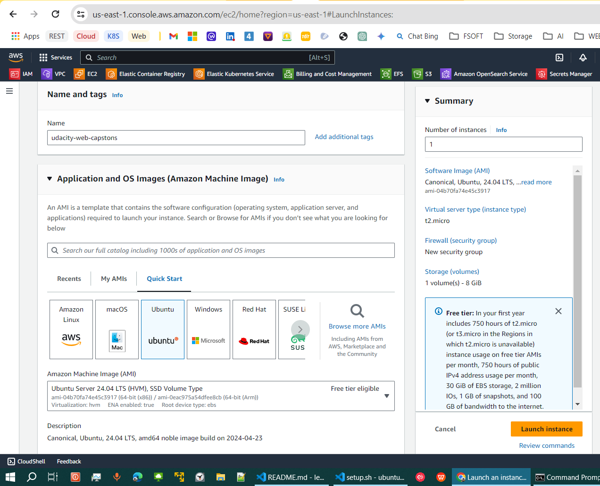

# fsnd udacity capstone restaurant management

## Motivation for the project

The application will help manage restaurant:
1. Allow chef and manager to list all food in restaurant DB.
2. Allow chef and manager to view the ingredients in each food.
3. Allow the managers to delete food in restaurant DB.
4. Allow the managers to add new food into restaurant DB.
5. Allow the managers to modify existing food in restaurant DB.

## The tech stacks/tools using in this project:

- [Flask](https://flask.palletsprojects.com/en/3.0.x/): a web application framework written in Python
- [SQLAlchemy](https://www.sqlalchemy.org/): the Python SQL toolkit and Object Relational Mapper that gives application developers the full power and flexibility of SQL
- [Auth0](https://auth0.com/docs/get-started/auth0-overview): a flexible, drop-in solution to add authentication and authorization services to your applications
- [AWS EC2](https://aws.amazon.com/ec2/): Secure and resizable compute capacity for virtually any workload for hosting website

## URL location for the hosted API

You can access this project [here](http://35.153.129.29:5000/login)
1. login with chef: 
    - username: chef1@gmail.com
    - password: 12345678Ab@
2. login with manager:
    - username: manager1@gmail.com
    - password: 12345678Ab@

## Hosting instructions

1. Launch an EC2 instance:

    

2. SSH into that instance:

    

3. Set up GIT and clone this project from Github:
    ```bash
    sudo apt install git
    git clone https://github.com/phanhoaithuabc/fsnd-udacity-capstone.git
    ```
4. Install dependency, export environment and run this application:
    ```bash
    pip install -r requirements.txt
    source setup.sh
    python3 api.py
    ```

## Run this project on local machine

This project contains a partially completed Flask server with a pre-written SQLAlchemy module to simplify your data needs. You will need to complete the required endpoints, configure, and integrate Auth0 for authentication.

```bash
# install dependency
pip install -r requirements.txt

# # set up the environment varriable
source setup.sh

# run application
python api.py
```

<!-- ## Hosting instructions -->


## Documentation For Backend Endpoint

### There are 2 Roles:

1. Chef role:
    - GET:foods: Can list all foods with title
    - GET:foods-ingredient: Can list foods with title and detail ingredient
2. Manager role:
    - GET:foods: Can list all foods with title
    - GET:foods-ingredient: Can list foods with title and detail ingredient
    - DELETE:foods: Can remove foods from database
    - PATCH:foods: Can edit existing foods from DB
    - POST:foods: Can create new foods

### There are 5 API:

You will need to provide detailed documentation of your API endpoints including the URL, request parameters, and the response body. Use the example below as a reference.

`GET /foods`

- Fetches a list of foods
- Request Arguments: None
- Results: A json contain foods with title

`GET /foods-ingredient`

- Fetches a foods detail
- Request Arguments: None
- Results: A json contain foods with detail ingredient


`DELETE /foods/{id}`

- Delete foods of the given ID if it exists
- Results: food's ID after delete

  ```javascript
  {
    "success": true,
    "delete": 1
  }
  ```

`POST /foods`

- Sends a post request to add a new foods into DB.
- Request Body:
  ```javascript
  {
    "title": "Miso-Butter Roast Chicken With Acorn Squash Panzanella",
    "ingredient": "whole chicken, 2¾ tsp. kosher salt, divided, plus more, 2 small acorn squash"
  }
  ```
- Result: Result of that foods we just add

`PATCH /foods/{id}`

- Update the exist foods in database
- Request Body:
  ```javascript
  {
    "title": "Thanksgiving Mac and Cheese"
  }
  ```
- results: The foods to update